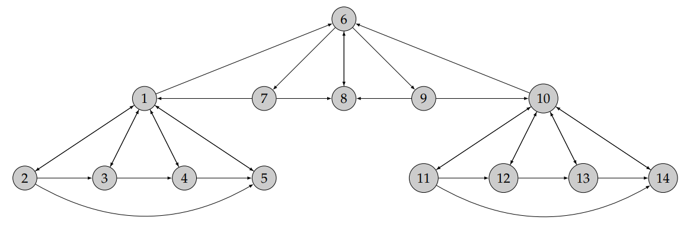

# Partie 1 : PageRank - version itérative, premier exemple

On considère le graphe du web simplifié suivant (avec $N = 14$ pages).

1. **Justifier** pourquoi l’algorithme de la puissance itérée (vu en détails dans le TD de R2.09 dédié à la SAE) permet de calculer le score de chacune des pages.
2. **Implémenter** cet algorithme pour calculer le score de chacune des pages du graphe
précédent. On vérifiera (numériquement) que le vecteur de score obtenu est bien approximativement solution de $r = Qr$.
3. **Analyser** la pertinence du résultat obtenu.