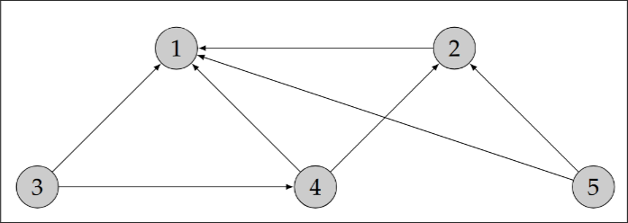

# Partie 2 : PageRank - version itérative, deuxième exemple

1. Appliquer l'algorithme de la Partie 1 au graphe suivant et commenter le résultat obtenu

    

    Pour éviter cela, on appliquera désormais l’algorithme de la puissance itérée à la matrice de transition $P = (pi,j)_{1≤i,j≤N}$ définie par

    $$
    p_{i,j} = \begin{cases}
    \alpha q_{i,j} + \frac{1 - \alpha}{N} & \text{si } N_j \neq 0, \\
    \frac{1}{N} & \text{sinon,}
    \end{cases}
    $$

    Où $\alpha \in [0,1]$ est un paramètre à choisir appelé "facteur d'amortissement".

2. En utilisant cette matrice de transition (avec $α$ = 0, 85), calculer les scores de chacune
des pages du graphe précédent. Commenter. On vérifiera (numériquement) que le vecteur de score obtenu est bien approximativement solution de $r = Pr$.

Dans la suite c’est cet algorithme que l’on désignera par `PageRank` version itérative. Il
est appelé itératif car il calcule successivement des approximations du vecteur de score $r$ cherché